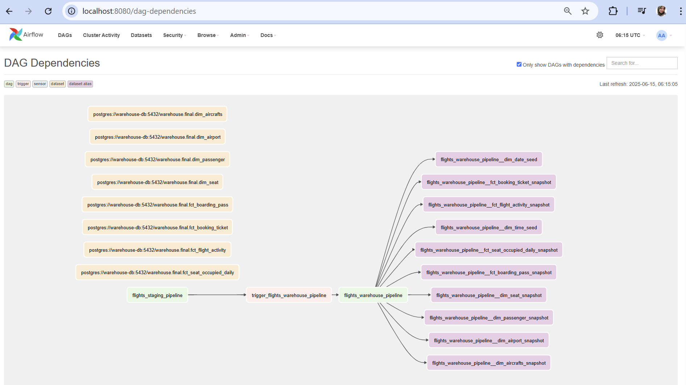

## Project Overview 

This project orchestrated an automated data pipeline that Extract Data from Data Source, Load to Data Staging and Transform the data to Data Warehouse. This project is a continuation of the previous one, [Previously](https://github.com/istywhyerlina/aiirflow-1), with several modifications.


# Architecture Description
- Docker: a containerization platform, used to manage and deploy data pipelines and applications. Services composed: airflow, Posgres as Data Source, Posgres as Data Warehouse and MinIO.
- Minio: MinIO as data Lake. stored data extracted from data source before processed to data warehouse.
- PosgreSQL: Data source is simulated and pre-loaded as part of the Docker setup. PostgreSQL also used as datawarehouse 
- Airflow: Apache Airflow is used for the scheduling and orchestration of data pipelines or workflows. Airflow Version -> 2.10.2  Executor ->  Celery Executor Additional Requirements ->  'astronomer-cosmos[dbt.postgres]'
- Dbt: Used for Transform the staging data into dimensional and fact tables 


## Pipeline Flow


Flow of Data Pipeline tasks that would be performed are:
- Extract: Extract data from data source (postgresSQL) and dump it to object storage (minio)
- Load: Extract data from minio object storage and upsert into a staging database (postgreSQL)
- Transform: Transforming data from staging data to datawarehouse, using DBT


There will be 2 DAGs, namely the “flights_staging_pipeline” and “flights_warehouse_pipeline”. There will be a task in flights_staging_pipeline DAG to trigger flights_warehouse_pipeline to Run.


## How to use this project? (preparations)

### 1. Preparations
- **Clone repo** :
  ```
  git clone https://github.com/istywhyerlina/airflow-dbt-case1
  ```

-  **Create env file** in project root directory  (Fill in the .env copy file, rename it as .env)
-  Run fernet.py, copy the code as  AIRFLOW_FERNET_KEY in evv file
### 2. Run Docker Compose :
  ```
  docker compose up --build -d
  ```

  If you're already have a running service, you can run this command
  
  ```
  docker compose down --volumes && docker compose up --build -d
  ```
### Import all Variables and Connections (Using CLI)

```
  docker exec -it <<airflow-webserver-container>> bash
  airflow connections import  <<name-file.yaml>>
  airflow variables import <<file.json>>
```


### Set up a Slack Notifier

Before importing variables, we need to set up the slack-notifier with SLACK. Step by step for making slack-notifier variable:
- Create workspace 
- [https://api.slack.com/apps](https://api.slack.com/apps)
- create new app 
- chose the workspace 
- Go to Webhook menu, choose create from the scratch, follow the instructions
- Copy the Webhook link to the variabe files

## Screenshot of Task





